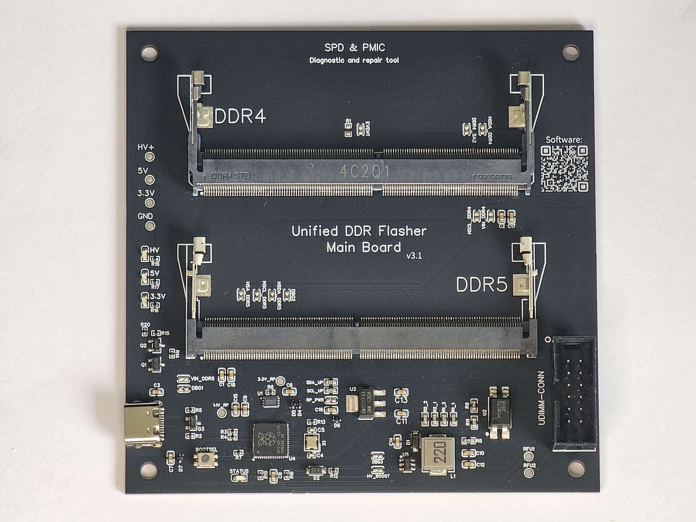
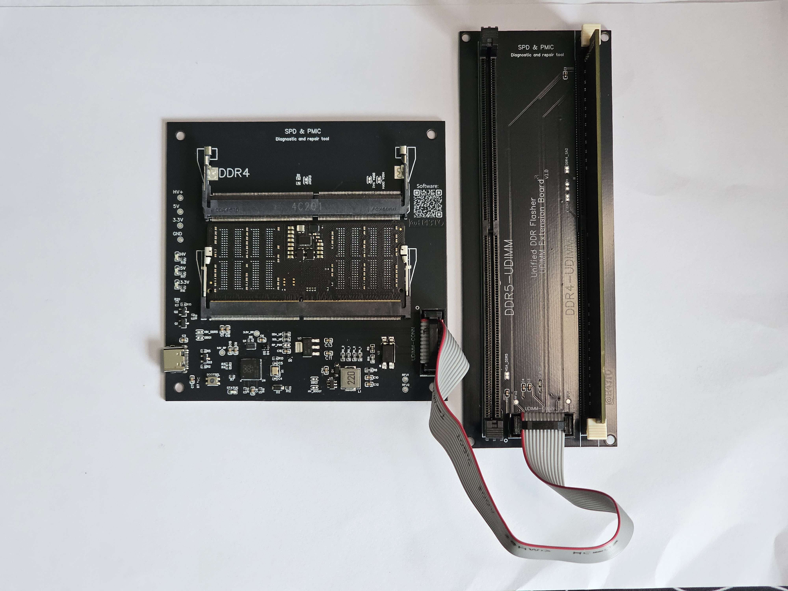
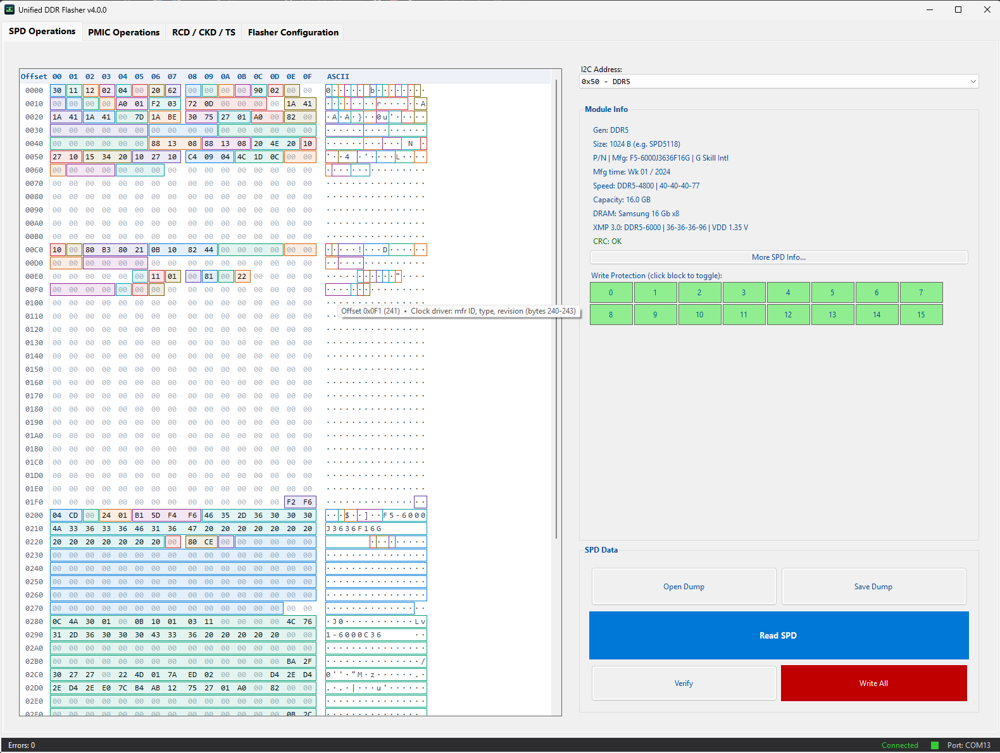

# Unified DDR Flasher

> One small USB device. Reads and writes SPD on every DDR4 and DDR5
> module you can think of, talks to DDR5 PMICs properly, and does all of
> it from a clean Windows GUI **or** the command line. Built for repair
> shops and overclockers who need a real tool.

<!-- ─────────────────────────────────────────────────────────────── -->



<!-- ─────────────────────────────────────────────────────────────── -->

If you repair memory, recover bricked DIMMs, profile-tune for
overclocking, or work on production lines that need SPDs flashed in
volume, this is built for you. The commercial tools in this space are
either expensive, locked down, or don't cover both DDR4 and DDR5
properly. So I built one that does.

It's developed and maintained by a single person — me — with the
support of a few people in the community who saw early prototypes and
helped steer it. Hardware ships from Hungary. Firmware, library and
app are signed and versioned together so you always know what's on
your device.

---

## See it in action

🎥 **[NorthWestRepair's video showing the device in use →](https://www.youtube.com/@northwestrepair/videos)**

A full walkthrough of the device and the software is coming. I'll drop
the link here when it goes up.

> _Demo video — coming soon. Will cover the GUI, the CLI, programming
> a fresh DDR5 module, and PMIC config end-to-end._

---

## What it does

- **Reads and writes SPD EEPROMs.** Full 256 / 512 / 1024-byte dumps on
  DDR4 and DDR5. Handles write-protect on its own — DDR4 RSWP
  and the block-level RSWP on DDR5.
- **Decodes SPD properly.** Module type, capacity, CAS list, every
  primary timing in both nCK and ps, and a CRC check with a one-click
  recompute. UDIMM, RDIMM, LRDIMM, SO-DIMM, CAMM2, CUDIMM, MRDIMM —
  all of them.
- **Programs DDR5 PMICs.** Read or write any register, burn vendor MTP
  blocks with the right unlock/lock sequence, change vendor passwords,
  watch voltages / currents / per-rail power live.
- **Real CLI.** Every GUI feature is scriptable. Text, JSON, or raw-hex
  output, with sane exit codes.
- **Improved reliability.** Single-retry on USB transient
  faults, automatic 400 → 100 kHz I²C clock fallback on marginal
  contacts, host-side reconnect loop if the USB stack re-enumerates.

---

## Supported memory

| Memory type                                  | Read | Write | RSWP | PMIC |
| ---------------------------------------------| :--: | :---: | :--: | :--: |
| DDR4 UDIMM / RDIMM / SO-DIMM                 |  ✅  |  ✅   |  ✅  |  —   |
| DDR5 UDIMM / RDIMM / SO-DIMM                 |  ✅  |  ✅   |  ✅  |  ✅  |
| DDR5 CUDIMM / CSODIMM / MRDIMM / HUDIMM      |  ✅  |  ✅   |  ✅  |  ✅  |

PMICs covered: PMIC5000, 5010, 5020, 5030, 5100, 5120, 5200.

---

## The hardware

The main board is the board in the photo above. RP2040-based,
programs DDR4 and DDR5 SO-DIMMs out of the box, plugs straight into any
USB-A or USB-C port (with a short adapter cable).

If you also need to work with full-size desktop DIMMs, there's an
extension board that takes UDIMM-form-factor modules:

<!-- ─────────────────────────────────────────────────────────────── -->



<!-- ─────────────────────────────────────────────────────────────── -->

### Pricing

Component costs keep moving, so this might change, but as of writing:

| Item                                                          | Price |
| ------------------------------------------------------------- | ----- |
| Main board (DDR4 & DDR5 SO-DIMM support)                      | $150  |
| Extension board (DDR4 & DDR5 UDIMM; more boards on the way)   | $25   |

### Ordering

Orders go via a PayPal money request. Send me a message with:

- Your full name
- Your PayPal email (has to match the money request)
- What you'd like to buy
- Country

I'll send you a PayPal money request. Full shipping address comes
later, once the package is ready to go out.

Shipping cost, import duties, taxes, and any other fees are on the
buyer. I ship from Hungary, usually via DHL, in a package that fits an
A4 letter envelope. Other shipping arrangements are possible — just
ask.

**Availability (as of late June 2026):** the last batch sold out, and the
next run ships around the middle-to-later half of August. You can order
now, and you should - placing an order is how I reserve your unit and
guarantee you one from the upcoming batch. It isn't a waitlist; the order
*is* the reservation, and the earlier you place it, the earlier you're in
the queue.

### Contact

- Email: **h43to.code@gmail.com**
- PayPal: [paypal.me/H43TO](https://paypal.me/H43TO)

---

## The program

<!-- ─────────────────────────────────────────────────────────────── -->



<!-- ─────────────────────────────────────────────────────────────── -->

The Windows app runs on .NET Framework 4.8.1 (Windows 11 already has
it; on Windows 10 you can grab it free from Microsoft). No installer —
it's a single `.exe`.

### Requirements

- Windows 10 (1903 or newer) or Windows 11
- .NET Framework 4.8.1
- A UDF programmer plugged into USB

### Installation

1. Grab the latest release ZIP from the **Releases** tab on GitHub.
2. Extract it anywhere and run `Unified-DDR-Flasher.exe`. No installer.
3. Plug the programmer in. Windows installs the CDC serial driver on
   its own — the board shows up as a regular `COMx` port.
4. If the device is fresh out of the bag, flash the firmware first
   (next section).

### Flashing or updating firmware

1. Hold the **BOOTSEL** button on the RP2040 board while plugging it in.
2. It comes up as a USB drive called **RPI-RP2**.
3. Drag `firmware/UDF_fw.uf2` onto that drive. It reboots itself.
4. The status LED goes solid once the firmware is ready.

If the program ever says `Firmware returned UNKNOWN (0x3F)`, the
firmware on the device is older than the host build expects. Reflash
with the matching `UDF_fw.uf2` and you're fine.

---

## Getting started

1. Open the **Flasher Configuration** tab (it's the default).
2. Pick the COM port and hit **Connect**. The status bar turns green.
3. Switch to **SPD Operations**. Detected modules show up in the
   address dropdown. Pick one, click **Read SPD**.
4. The hex view shows the raw bytes. Click **Parsed Fields** to
   expand the decoded panel — timings, capacity, CAS list, CRC status,
   all of it.
5. To write, click **Open Dump…**, pick a `.bin`, and hit **Write All**.

The **Recalc & Fix CRC** button patches the in-memory dump so the next
**Write All** writes a valid CRC. It doesn't push to the DIMM on its
own — you stay in control of the actual write.

---

## PMIC operations

DDR5 only (DDR4 doesn't have a PMIC).

- **Read All Registers** dumps the full 256-byte register space.
- **Live Measurements** streams real voltages (mV), currents (mA), and
  per-rail power (mW) from the chip. The poll rate is configurable in
  the **Advanced** dialog.
- **Burn Vendor Block** programs one of the three 16-byte MTP blocks.
  There's a confirmation dialog before anything actually fires.
- **Change Password** reprograms the vendor unlock password (also
  MTP-burned).

---

## Command line

Every GUI feature is also available headless. Pass no arguments and you
get the GUI; pass anything and you're in CLI mode.

```
Unified-DDR-Flasher.exe --help
Unified-DDR-Flasher.exe ping --port COM4
Unified-DDR-Flasher.exe scan --port COM4 --output-format json
Unified-DDR-Flasher.exe spd read 50 --port COM4 --out my_module.bin
Unified-DDR-Flasher.exe spd parse 50 --port COM4
Unified-DDR-Flasher.exe spd parse-file my_module.bin
Unified-DDR-Flasher.exe spd write 50 --port COM4 --in my_module.bin
Unified-DDR-Flasher.exe spd verify 50 --port COM4 --in my_module.bin
Unified-DDR-Flasher.exe spd fix-crc 50 --port COM4
Unified-DDR-Flasher.exe spd hub-reg get 50 MR11 --port COM4
Unified-DDR-Flasher.exe spd pswp get 50 --port COM4
Unified-DDR-Flasher.exe pmic measure 48 --port COM4 --output-format json
Unified-DDR-Flasher.exe pmic toggle-vreg 48 --port COM4
Unified-DDR-Flasher.exe pmic unlock 48 --port COM4
Unified-DDR-Flasher.exe pmic change-password 48 73 94 AA BB --port COM4
Unified-DDR-Flasher.exe pmic pgood-pin --port COM4
Unified-DDR-Flasher.exe eeprom read 0 16 --port COM4 --output-format hex
```

### Skip the port flag

`--auto-detect` walks the COM ports and uses the first one that
responds to a ping:

```
Unified-DDR-Flasher.exe ping --auto-detect
```

### Survive a dodgy cable

For long scripted operations over a cable that occasionally drops:

```
Unified-DDR-Flasher.exe spd write 50 --port COM4 --in dump.bin --reconnect-timeout 30
```

If the port disappears mid-command, the tool waits up to 30 s for it to
come back, then carries on.

### Exit codes

| Code | Meaning |
| :--: | ------- |
|  0   | Success |
|  1   | Device not found / ping failed |
|  2   | I²C / SPD error |
|  3   | Verification failed |
|  4   | CRC error |
|  5   | Write error |
|  6   | Bad arguments / usage error |

Handy in scripts:

```cmd
Unified-DDR-Flasher.exe spd verify 50 --port COM4 --in golden.bin --quiet
if errorlevel 3 echo Module differs from golden image
```

---

## Roadmap

The project and device itself is in active development. Here is the stuff I'm working on or planning, in roughly the
order I expect to ship it.

### Next release (in progress)
- **RDIMM extension board** — DDR4 *and* DDR5 RDIMM form factor.
- **Interactive SPD editor in the GUI** — edit every SPD field
  (timings, capacity, organisation, manufacturer block, voltages,
  refresh, 3DS, common module block) through a structured view instead
  of a hex editor, with live CRC recompute and a validation pass that
  flags out-of-spec values before you write.

### Mid-term
- **LRDIMM full support** — the host-side code paths exist; what's
  missing is enough real LRDIMM hardware to validate against.
- **CAMM2 / LPCAMM2 extension board** — single-piece flat connector,
  current draft of the spec is well-supported by what the main
  board already does on the communication side.
- **Wider PMIC coverage** — keep adding entries as new MTP layouts and
  password schemes show up in the wild.

### On demand
- **DDR3, DDR2 and DDR1 extension boards** — the SPD content layouts
  for these older formats are well-known (EE1002 / SMBus, much
  smaller EEPROMs, no PMIC) and the main board's hardware can talk to
  them today. I'll build these if there's enough interest — message
  me if you have a real use case (retro repair, vintage system
  restoration, validation labs running older hardware).
- **Production-line batch mode** — script-driven bulk-flashing helper
  with per-unit logging.

If there's something you'd find useful that isn't here, open an issue
or send me an email. The tool is built around real workflow needs, not
a wishlist.

## FAQ

**Can I buy one right now?**
Yes - and ordering now is how you lock one in. The current batch sold
out, but placing an order reserves you a unit from the next run (shipping
mid-to-later August 2026) and guarantees you one once I build it. So
don't wait for stock to "come back" - the order is the reservation. Send
me your details (see [Ordering](#ordering)) and I'll send a PayPal money
request.

**What's the difference between the main board and the extension board?**
The main board does DDR4 and DDR5 **SO-DIMMs** on its own and plugs
straight into USB. The extension board sits on top of it and adds
full-size **UDIMM** desktop modules. If you only work with laptop
memory, the main board is all you need; if you touch desktop DIMMs, get
both. More extension boards (RDIMM now, older formats on demand) are in
the works.

**Do I have to flash firmware before I can use it?**
If it's brand new, once. Hold BOOTSEL while plugging it in, drop
`UDF_fw.uf2` onto the drive that appears, done. After that the app keeps
you on matching firmware and tells you if the device is ever running
something too old. Full steps are under
[Flashing or updating firmware](#flashing-or-updating-firmware).

**Does it work on macOS or Linux?**
The GUI is a Windows app (.NET Framework 4.8.1). The device itself is
just a USB serial port, so the protocol works anywhere - but there's no
native Mac or Linux GUI yet. On those platforms a Windows VM with USB
pass-through works today, and a cross-platform CLI is on my list.

**Can it recover a bricked DIMM?**
Often, yes. If the "brick" is a bad or corrupt SPD - wrong timings, a
broken CRC, a botched write - then reading the chip, fixing it, and
writing a known-good dump back is exactly what this is for. What it
can't fix is dead silicon: if the EEPROM or the DRAM has physically
failed, no flasher brings that back. But, if you run on the regulators
you might see the dead chip heat up using a thermal camera!

**Can I edit XMP / EXPO profiles?**
You can read, write, and verify the whole SPD today, so if you have a
dump with the profile you want, you can write it. A structured in-GUI
editor for individual fields (timings, capacity, the profile blocks) is
the next big feature - see the [Roadmap](#roadmap).

**Is writing reversible? Will I brick my module?**
Read the module first and save that dump - that's your undo button. The
app deliberately routes edits through dump files plus the Parsed Fields
dialog (with its CRC fix) instead of letting you poke raw bytes live,
specifically so you don't write a module with a broken checksum. Write
the original dump back and you're exactly where you started.

**Why does a freshly-read module say "CRC FAIL"?**
Usually it's fine. Modules tuned with XMP or EXPO don't always keep the
checksum the standard expects, so the warning fires even though the data
is good. If the decoded timings look sane, **Recalc & Fix CRC** sorts
it. A genuinely corrupt SPD is the less common case.

**Do I have to deal with write protection myself?**
No. Write protection - RSWP on DDR4, and the block-level protection on
DDR5 - is handled for you: the device clears it for the write and puts
it back afterwards. You just hit Write.

**Does it support DDR3, DDR2, or older memory?**
Not out of the box, but the main board can physically talk to those
older EEPROMs and their SPD layouts are well understood. I'll build
DDR3/DDR2/DDR1 extension boards if there's real demand - if you've got a
use case (retro repair, vintage restoration, a validation lab on older
kit), email me.

**What about RDIMM and LRDIMM?**
The software for the DDR5 sideband devices (the RCD, clock drivers,
thermal sensors, hub registers) already ships in this release - it's
just switched off until the RDIMM extension board is out. LRDIMM's
host-side code exists too; what it's waiting on is enough real LRDIMM
hardware to validate against.

**Which PMICs are supported, and can I damage one?**
PMIC5000, 5010, 5020, 5030, 5100, 5120, and 5200. You can read every
register freely. The writes that matter - burning an MTP block, changing
the vendor password - sit behind a confirmation dialog and the proper
unlock/lock sequence, because those are one-way. Read first, know what
you're changing, and you're fine.

**Can I use it in scripts or on a production line?**
Yes. Every GUI action has a CLI equivalent with text/JSON/hex output and
real exit codes, so it drops into batch files and CI cleanly. A
dedicated bulk-flash mode with per-unit logging is on the roadmap.

**Is the firmware or the library open source?**
The application source in this repo is Apache 2.0 - use it, modify it,
ship it. The firmware image and the communication library are
proprietary and provided for use with hardware you bought; their source
isn't published, and neither is the hardware design. Details under
[License](#license).

**The app says the firmware is too old. Now what?**
Reflash the device with the `UDF_fw.uf2` from the same release as your
app (BOOTSEL, drag, done). The host and firmware are versioned together
on purpose, so a mismatch is caught up front instead of misbehaving
later.

**How do payment and shipping work?**
PayPal money request. Send me your name, the PayPal email you'll pay
from, what you want, and your country; I send a money request, and the
full address comes later when it's ready to ship. I post from Hungary,
usually DHL/Fedex, in an A4-envelope-sized package. Shipping, duties and any
taxes are on you. Other arrangements are possible - just ask.

---

## Troubleshooting

**"Device on COMx did not respond to CMD_PING after 8 attempts"**

Three things to check, in order:

1. Is the firmware actually flashed? The device should show up as a CDC
   serial port. If it's `RPI-RP2` instead, that's bootloader mode —
   drop the `UDF_fw.uf2` on it.
2. Anything else holding the port open? PuTTY, another instance of the
   app, Arduino IDE's Serial Monitor — they'll all block it.
3. Is the USB cable a *data* cable? Charge-only cables look identical
   and will trip you up.

**"Firmware returned UNKNOWN (0x3F)"**

Firmware on the device is older than the host expects. Reflash with the
matching `UDF_fw.uf2` from this release.

**I²C / SPD errors that come and go**

The firmware and the host already do single-retry plus 400 → 100 kHz
clock fallback. If you're still getting errors, the most common culprit
is a marginal socket contact — clean the gold fingers on the DIMM and
reseat it. Bad USB cables also do this.

**"CRC FAIL" on a freshly-read module**

Either the module's been XMP- or EXPO-modified (those vendors don't
always follow the standard CRC convention), or the SPD's actually corrupt.
If the timings look valid, **Recalc & Fix CRC** is what you want.

---

## Funding the project

I'm a chemistry student, and every cent that comes in from this project
goes straight into my academic studies and research. Tuition, lab
consumables, reagents, instrument time — the usual costs of being a
student doing home research and saving up for uni.

If you're in **material science** or **synthetic chemistry** — or
adjacent fields that touch either — and you'd like to talk shop,
collaborate, point me at interesting reading, or just trade notes,
I don't mind if you reach out :D 

📧 **h43to.code@gmail.com**

---

## Inspirations and thanks

Several existing projects in this space did big things first and
shaped how I thought about parts of this one:

- **[@1a2m3 / SPD-Reader-Writer](https://github.com/1a2m3/SPD-Reader-Writer)** — Arduino-based SPD reader/writer; one of the first widely-shared open SPD tools.
- **[@integralfx / DDR4XMPEditor](https://github.com/integralfx/DDR4XMPEditor)** — DDR4 XMP profile editor with a clean, focused UI.
- **[@edlf / DDR5SPDEditor](https://github.com/edlf/DDR5SPDEditor)** — DDR5 SPD editor; the closest reference for what a modern editor should look like.

Special thanks to **[@edlf](https://github.com/edlf)** and
**@NWR** ([NorthWestRepair on YouTube](https://www.youtube.com/@northwestrepair)),
who both backed this project early on and gave honest, detailed
feedback when it really mattered. NWR also made the video linked at
the top — having someone whose work I respect actually try it out and
record it was a milestone.

---

## A note on how this was built

I'm a chemistry student, not a software engineer. The architecture,
the protocol, the firmware logic, and the SPD parsing rules are all
mine, built from publicly available specifications and the official
Raspberry Pi Pico SDK.

AI tools helped me clean up the C# code and write the comments —
because writing idiomatic .NET WinForms code is a different skill from
understanding what the code needs to do. Treat that the way you'd
treat a tutor: it helped me ship something readable, but the design
calls, the tests, and the choice of what's correct are mine.

Everything in this project came from documents I'm legally entitled to
read and from work I'm legally entitled to do. No leaked datasheets,
no code lifted from other projects.

---

## License

The public source code in this repository is licensed under the
**Apache License 2.0** — see [`LICENSE`](LICENSE) for the full text.
In short: you may use, modify, and redistribute the source under the
terms of that licence, including a patent grant.

The following are **not** open-source and are distributed under
proprietary terms:

- **The compiled firmware** (`firmware/UDF_fw.uf2`) — provided for use
  with hardware you purchased; redistribution is not permitted.
- **The compiled communication library** (`lib/prebuilt/UDF-Core.dll`)
  — same as above. The C# source for this library is not published.
- **The hardware design itself** — schematics, layout, BOM and
  fabrication files are not published. All the PCB are made by a reliable
  manufacturing firm, and are assembled by me one at a time!

If you want to use any of the proprietary components in a way the
licence doesn't cover (commercial redistribution, OEM integration,
contract manufacturing), just ask — I'm reasonable about it.

© 2026 H43TO. Apache-licensed source as marked; all other rights
reserved.
